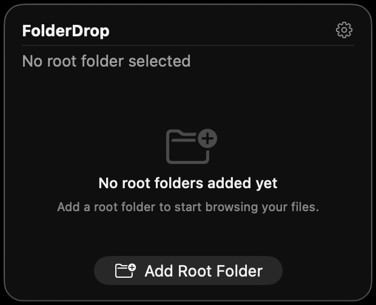
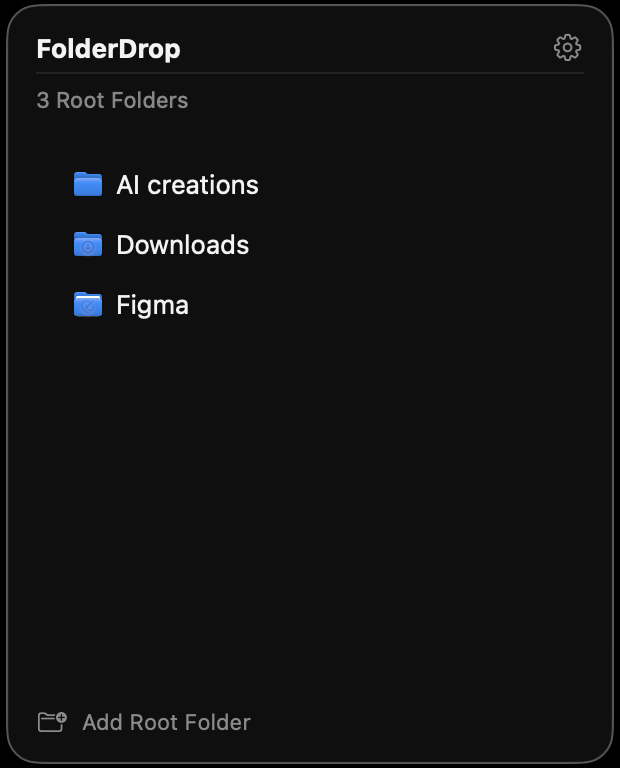
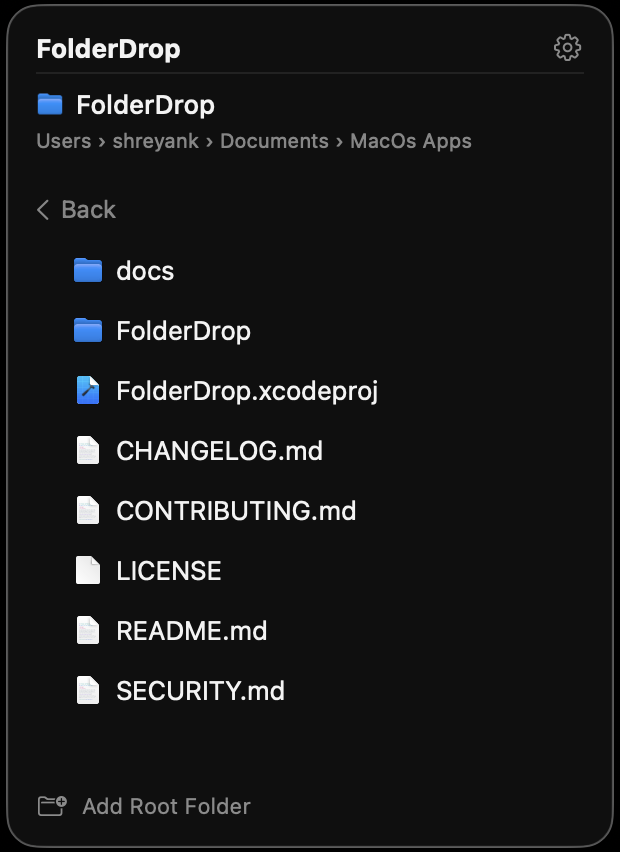
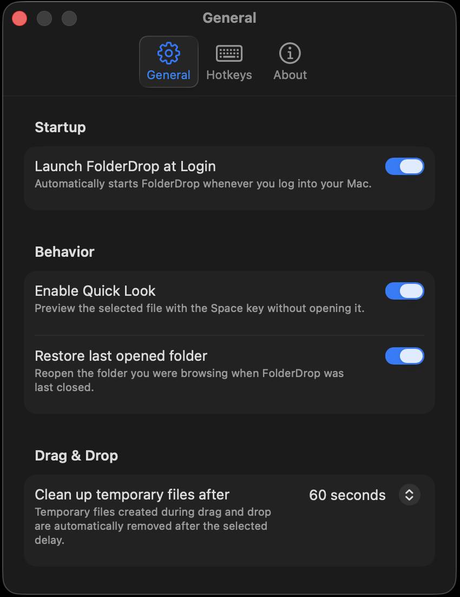
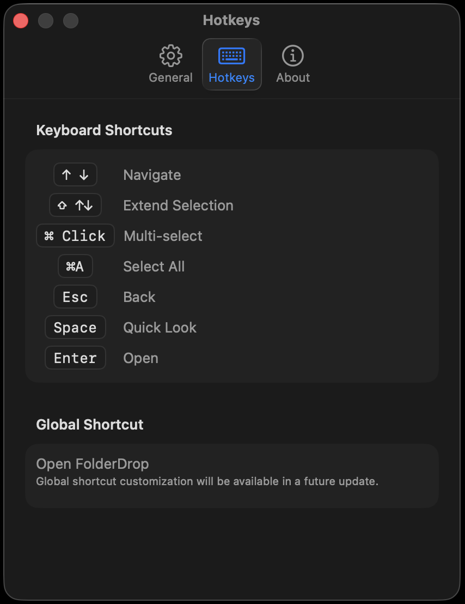
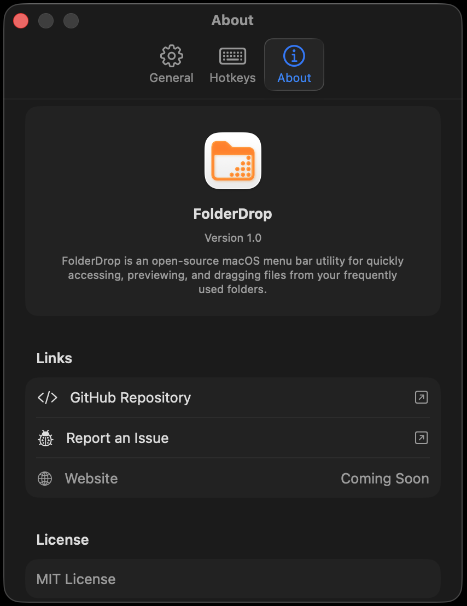
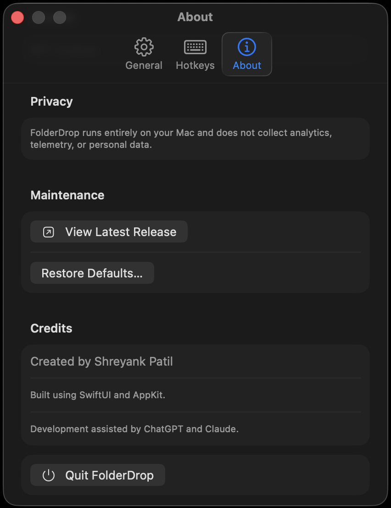
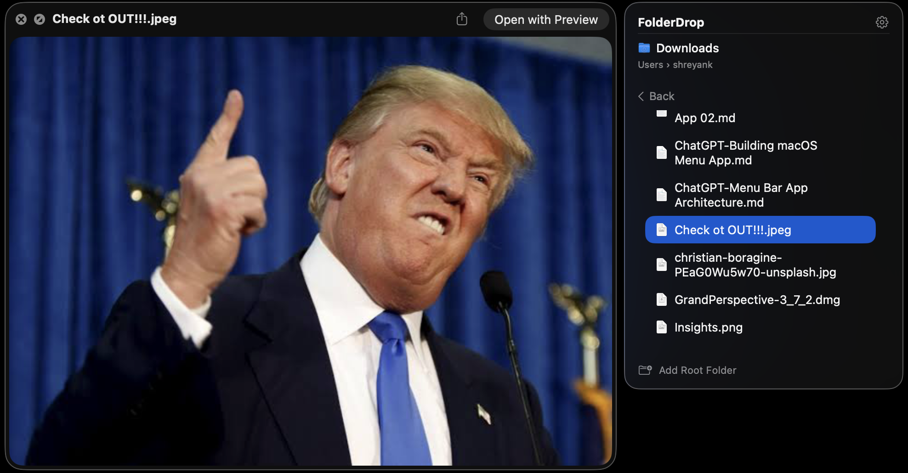
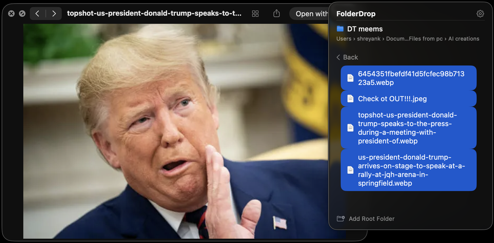

<div align="center">


A free and open-source macOS menu bar app for quickly accessing, previewing, and dragging files from your frequently used folders.

[](https://github.com/Shreyank67/FolderDrop/releases)
[](LICENSE)


</div>

---

[](https://www.youtube.com/watch?v=szUlrb25cSE)

🎥 Watch the 56-second demo on YouTube to see FolderDrop in action.

📺 YouTube: [https://www.youtube.com/watch?v=szUlrb25cSE](https://www.youtube.com/watch?v=szUlrb25cSE)

---

## Contents

- [Features](#features)
- [Privacy](#privacy)
- [Screenshots](#screenshots)
- [Installation](#installation)
- [Building](#building)
- [Keyboard Shortcuts](#keyboard-shortcuts)
- [Project Structure](#project-structure)
- [Roadmap](#roadmap)
- [Known Limitations](#known-limitations)
- [Contributing](#contributing)
- [Changelog](#changelog)
- [Credits](#credits)
- [License](#license)

---

## Features

- [x] Multiple root folders
- [x] Folder navigation with back/breadcrumb support
- [x] Root folder context menu (Open, Reveal in Finder, Remove)
- [x] Native Quick Look preview (single file or multi-selection)
- [x] Native drag & drop (single and multi-file, to Finder, Mail, Chrome, Slack, VS Code, and more)
- [x] Finder-style multi-selection (click, ⌘-click, ⇧-click/⇧-arrow)
- [x] Full keyboard navigation
- [x] Native file icons (matches what Finder shows for every file type)
- [x] Live folder refresh (auto-updates when files change on disk)
- [x] Automatic cleanup when a root folder is deleted or becomes unavailable
- [x] Launch at Login
- [x] Native Settings window
- [x] Security-scoped bookmarks (persists folder access across launches)
- [x] Menu bar application (no Dock icon, no regular window)

---

## Privacy

FolderDrop browses the folders you point it at, and does nothing else.

- Does not connect to the internet
- No analytics
- No telemetry
- No crash reporting
- No advertising
- No tracking
- Folder bookmarks stay on your Mac — never uploaded anywhere
- File contents are never uploaded anywhere
- Only accesses folders you explicitly grant access to through the native macOS file picker
- Runs entirely locally

See [docs/architecture.md](docs/architecture.md) for how folder access and persistence actually work under the hood. Found a security or privacy issue? See [SECURITY.md](SECURITY.md) for how to report it.

---

## Screenshots



*The onboarding screen shown when no root folders have been added yet.*



*The top-level list of root folders added to FolderDrop.*



*Browsing inside a folder, showing files and subfolders with native icons.*



*The General settings page — Launch at Login, Quick Look, restore last folder, drag cleanup delay.*



*The Hotkeys settings page listing all keyboard shortcuts.*




*The About settings page — app info, project links, License/Privacy/Credits, and maintenance actions (View Latest Release, Restore Defaults, Quit).*



*Quick Look previewing a single selected file directly from FolderDrop.*



*Quick Look cycling through a full multi-selection.*

---

## Installation

### Download

Grab the latest build (`FolderDrop_v1.0.0_macOS.zip`) from the [Releases](https://github.com/Shreyank67/FolderDrop/releases) page, unzip it, and move `FolderDrop.app` to `/Applications`.

FolderDrop isn't code-signed or notarized yet, so macOS may block it on first launch with a message saying it can't verify the app is free of malware. If that happens: go to **System Settings → Privacy & Security**, scroll to the Security section, and click **Open Anyway** next to the FolderDrop warning, then confirm. You only need to do this once — the zip also includes an Installation Guide with the same steps.

### Build from Source

See [Building](#building) below.

### Homebrew

> Not yet available. A `brew install --cask folderdrop` formula is planned once versioned releases exist — see [docs/roadmap.md](docs/roadmap.md).

---

## Building

FolderDrop is a standard Xcode project — no external dependencies or package managers are involved.

**Requirements:**
- macOS 14 or later (to run the built app; matches the project's deployment target)
- Xcode 26 or later (to build)

**Steps:**

```bash
git clone https://github.com/Shreyank67/FolderDrop.git
cd FolderDrop
open FolderDrop.xcodeproj
```

Then build and run with `⌘R`. FolderDrop is sandboxed (`ENABLE_APP_SANDBOX = YES`); the first time you add a folder, macOS will prompt for access, and FolderDrop persists that access using a security-scoped bookmark (see [docs/architecture.md](docs/architecture.md)).

To build from the command line instead:

```bash
xcodebuild -project FolderDrop.xcodeproj -scheme FolderDrop -configuration Debug build
```

---

## Keyboard Shortcuts

| Shortcut | Action |
|---|---|
| `↑` `↓` | Navigate |
| `⇧` + `↑` `↓` | Extend selection |
| `⌘` + Click | Multi-select (toggle) |
| `⇧` + Click | Extend selection (range) |
| `⌘A` | Select all |
| `⌘⇧A` | Deselect all |
| `Esc` | Back |
| `Space` | Quick Look |
| `Enter` | Open file / navigate into folder |

---

## Project Structure

```
FolderDrop/
├── FolderDropApp.swift      # App entry point (MenuBarExtra + Settings scene)
├── ContentView.swift        # Root view — owns navigation/selection state
├── Models/                  # Data shapes and pure navigation/selection logic
├── Services/                # macOS API bridges (filesystem, persistence, Quick Look, login items)
└── Views/                   # Stateless UI components
```

Models hold data and pure logic, Services wrap macOS/AppKit APIs behind small focused interfaces, and Views are stateless — they receive data and callbacks from `ContentView`, which is the single place app-wide state and behavior are coordinated.

For a deeper explanation of *why* the architecture looks like this — MenuBarExtra, FolderWatcher, selection, Quick Look, persistence, settings, and security-scoped bookmarks — see **[docs/architecture.md](docs/architecture.md)**.

---

## Roadmap

**Version 1.1 (planned)**
- Investigate a non-sandbox architecture for direct/GitHub distribution to simplify drag & drop and file access (under investigation, not decided — see [docs/known-limitations.md](docs/known-limitations.md))
- Rework drag & drop to better match Finder's file-reference behavior
- Folder drag & drop support
- Sorting options (date modified, size, kind, etc.)
- Improved Quick Look behavior (fullscreen focus restoration)
- Automatic update checking (View Latest Release currently only opens the GitHub releases page manually)
- Search/filter within the current folder

**Future Ideas**
- Finder Sync extension for deeper Finder integration
- Custom/remappable keyboard shortcuts
- Folder favorites/pinning

Full details, including completed work and version-by-version breakdown, live in **[docs/roadmap.md](docs/roadmap.md)**.

---

## Known Limitations

- **Quick Look**
  - In some fullscreen applications (for example, Figma), Quick Look may occasionally lose keyboard focus when closing with the Space key. This does not affect normal desktop usage.

- **Drag & Drop**
  - Some applications (currently confirmed with DaVinci Resolve) import the temporary staged file path instead of the original file location. This can cause broken references after FolderDrop cleans up its temporary drag files.

- **Folder Drag & Drop**
  - Dragging folders is not currently supported. Only files can be dragged.

- **Sorting**
  - Folder contents are currently displayed alphabetically. Additional sorting options (date modified, size, etc.) are planned for a future release.

- **Settings Window**
  - The Settings window currently opens in its own desktop/Space instead of the active fullscreen Space due to SwiftUI/AppKit limitations.

- **Back Button**
  - Minor inconsistency in the Back button's hit-testing near the top edge of its clickable area.

These limitations are tracked for future releases and do not affect the core functionality of FolderDrop. See **[docs/known-limitations.md](docs/known-limitations.md)** for more detail on each item. For features that haven't been built yet, see the [Roadmap](#roadmap)'s own [Known Limitations](docs/roadmap.md#known-limitations) list.

---

## Contributing

Contributions are welcome. See **[CONTRIBUTING.md](CONTRIBUTING.md)** for how to get set up and what to expect from a pull request.

---

## Changelog

See **[CHANGELOG.md](CHANGELOG.md)** for a version-by-version summary of what's shipped, in [Keep a Changelog](https://keepachangelog.com/en/1.1.0/) format.

---

## Credits

Created by [Shreyank Patil](https://github.com/Shreyank67). Built using SwiftUI and AppKit. Development assisted by ChatGPT and Claude.

---

## License

FolderDrop is released under the **MIT License**. See [LICENSE](LICENSE) for the full text.
